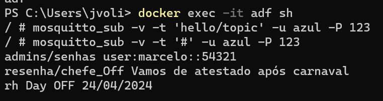
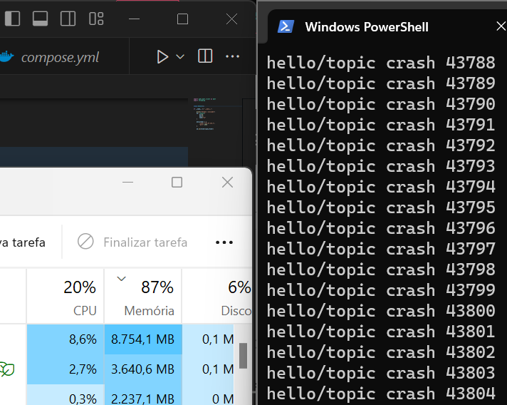

# Simulador de ataques MQTT

| Aluno                    | Curso                  | Módulo | Grupo |
|--------------------------|------------------------|--------|-------|
| João Vitor Oliveira    | Engenharia da Computação | 9      | 5     |

Atividade feita em conjunto com os membros do grupo: Caio e Kil

## Descrição
Avaliar a tríade CIA em uma conexão com um broker MQTT.

## Setup do ambiente 

Sigua as intruções abaixo para realizar simular os testes:
1. Certifique se de ter instalado as seguintes tecnologias: 
- [Python](https://www.python.org)
- [Mosquitto](https://mosquitto.org)
- [Docker](https://www.docker.com/get-started/)

2. Execulte os paços do seguinte diretório: [Link para o diretório](https://github.com/rafaelmatsuyama/Inteli-T2-EC-M09)

## Perguntas - Roteiro
1. O que acontece se você utilizar o mesmo ClientID em outra máquina ou sessão do browser? Algum pilar do CIA Triad é violado com isso?
    R: Ele é desconectado da sessão anterior e conectado na nova sessão. O pilar de Disponibilidade é violado, pois o cliente é desconectado sem aviso prévio.

2. Com os parâmetros de resources, algum pilar do CIA Triad pode ser facilmente violado?
    R: Sim, como nesse exemplo não há a criação de nivél de acesso aos tópicos é possivel ferir a Confiabilidade do sistema, já que todo usuário tem acesso a qualquer tópico do sistema. Outra forma de ferir a CIA Triad é pela Disponibilidade, pois o container pode ser facilmente derrubado por falta de recursos em uma eventual sobrecarga de mensagens.

3. Já tentou fazer o Subscribe no tópico #? (sim, apenas a hashtag). O que acontece?
    R: O '#' é um wildcard multi-level, um método coringa que permite inscrever-se em todos os tópicos disponíveis. Isso pode ser perigoso, pois pode violar a confidencialidade das mensagens.

4. Sem autenticação (repare que a variável allow_anonymous está como true), como a parte de confidencialidade pode ser violada?
    R: Como qualquer pessoa pode se conectar ao broker e ler mensagens de qualquer tópico, acaba por violaolar a Confidencialidade destas.

## Perguntas - Desenvolvimento

### 1. Como você faria para violar a confidencialidade?
R: Para violar a confidencialidade, eu poderia me inscrever em tópicos que transitam informações sensíveis, uma vez que o broker não possui uma lista de controle de acesso (ACL) para limitar o acesso a tópicos específicos. Uma vez que obtivesse quaisquer credenciais de acesso, poderia publicar e ler mensagens em tópicos que não deveria ter acesso.

### 2. Como você faria para garantir a integridade do broker MQTT?
R: Para garantir a integridade dos dados além de credencias de acesso, cria uma lista de controle de acesso (ACL) para tópicos específicos, de forma a garantir que apenas usuários autorizados possam publicar mensagens em tópicos nestes evitando o compromentimento da integridade dos dados. Além disso criaria uma lógica para mater de forma criptografada um historico de menssagens, juntamente com um protocolo de backups mensais das mesmas.

Referenicia: https://informationsecurity.wustl.edu/items/confidentiality-integrity-and-availability-the-cia-triad/Introdução

